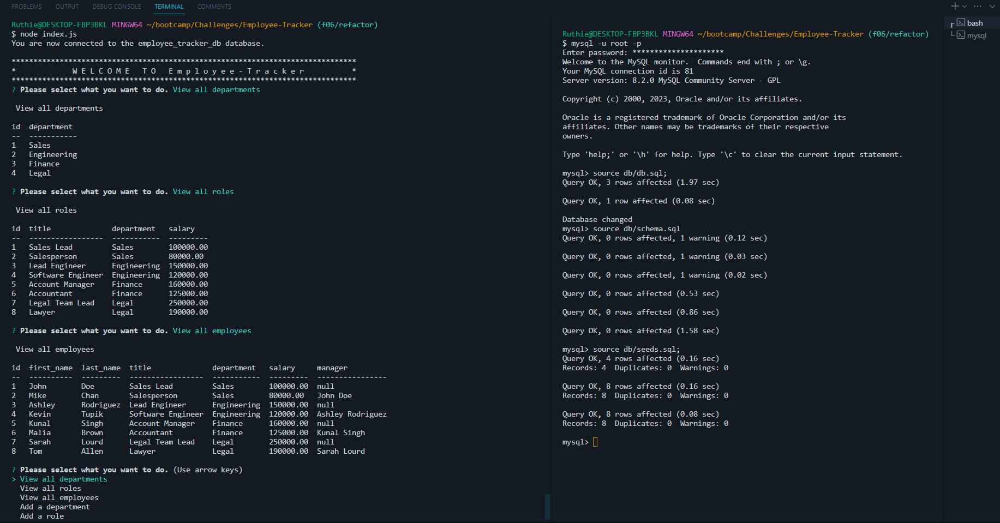

# Employee-Tracker


## Description

This application is to help view and interact with information stored in databases. The application is a Content Management System (CMS)
which presents the user/client with a series of prompts to view, manage business departments, assign roles, & add or edit employees.

The application uses the MySQL2 package to connect to a MySQL database & perform queries, and uses Inquirer package to prompt the user. The
console.table package was included to print MySQL rows to the console.

## Table of Contents

- [User Story](#user-story)
- [Acceptance Criteria](#acceptance-criteria) 
- [Installation](#installation) 
- [Usage](#usage) 
- [Example](#example) 
- [Deliverables](#deliverables) 
- [License](#license) 
- [Credits](#credits) 
- [Questions](#questions)

## User Story

```
AS A business owner
I WANT to be able to view and manage the departments, roles, and employees in my company
SO THAT I can organize and plan my business
```

## Acceptance Criteria

```
GIVEN a command-line application that accepts user input
WHEN I start the application
THEN I am presented with the following options: view all departments, view all roles, view all employees, add a department, add a role, add an employee, and update an employee role
WHEN I choose to view all departments
THEN I am presented with a formatted table showing department names and department ids
WHEN I choose to view all roles
THEN I am presented with the job title, role id, the department that role belongs to, and the salary for that role
WHEN I choose to view all employees
THEN I am presented with a formatted table showing employee data, including employee ids, first names, last names, job titles, departments, salaries, and managers that the employees report to
WHEN I choose to add a department
THEN I am prompted to enter the name of the department and that department is added to the database
WHEN I choose to add a role
THEN I am prompted to enter the name, salary, and department for the role and that role is added to the database
WHEN I choose to add an employee
THEN I am prompted to enter the employee’s first name, last name, role, and manager, and that employee is added to the database
WHEN I choose to update an employee role
THEN I am prompted to select an employee to update and their new role and this information is updated in the database
```

## Installation

Once you have created an Employee-Tracker repository on GitHub and have cloned it to your local repository, continue with the following installation instructions.

1. Install node.js by following the [node.js](https://nodejs.org/en/) instructions.

2. Install the npm Inquirer package ("npm i inquirer").

3. Install the npm MySQL2 package ("npm i mysql2").

4. Install the npm console.table package ("npm install console.table --save").

5. Update .gitignore file as needed!

## Usage

Once you have completed the installation for the Employee-Tracker application, continue with the following usage instructions.

1. Connect to the MySQL server, done so by opening a terminal and entering: 'mysql -u root -p'
    - Add the user info and connect to the server.

2. Create the database by entering: 'source db/db.sql;'

3. Create the database tables by entering: 'source db/schema.sql;'

4. Seed the database tables by entering: 'source db/seeds.sql;'

5. Initiate/run the application by entering: 'node index.js'

6. Prompts for actions to go through and add to the database will be presented through the terminal, once you're done with that then select 'Exit the application' from the prompts.

## Example

### Generated Command Line Output



## Deliverables

[Employee-Tracker Repository](https://github.com/ruthiepina/Employee-Tracker)

[Walkthrough Video](https://drive.google.com/file/d/1uoQL21RHSlRoRErJBM5GvIDdufrQOadH/view)

## License

Copyright (c) 2024 Ruthie Pina. All rights reserved.

Licensed under the [MIT License](https://choosealicense.com/licenses/mit).

## Credits

- https://git.bootcampcontent.com/University-of-Utah/UofU-VIRT-FSF-PT-10-2023-U-LOLC/-/tree/main/12-SQL

- https://www.sqlshack.com/

- https://www.w3schools.com/sql/default.asp

- https://dev.mysql.com/doc/

## Questions

Employee Tracker created by [Ruthie Pina](https://github.com/ruthiepina). Any additional questions or comments, please send an email to:
<ruthiepina@gmail.com>.
